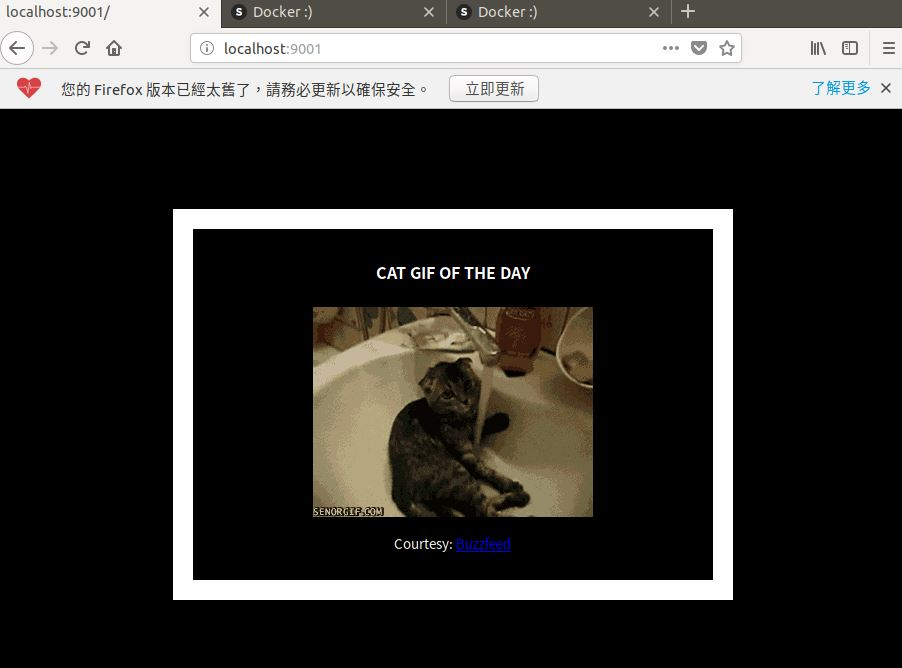

# Docker Basics

## 1. 什麼是容器

VM和容器雖然都屬於虛擬化的技術，目標都是為了將一套應用程式所需的執行環境打包起來，建立一個孤立環境，方便在不同的硬體中移動，但兩者的運作思維截然不同。簡單來說，常見的傳統虛擬化技術如vSphere或Hyper-V是以作業系統為中心，而Container技術則是一種以應用程式為中心的虛擬化技術。docker就是一種容器的實作。


兩者最明顯的差別是，虛擬機器需要安裝作業系統(安裝Guest OS)才能執行應用程式，而Container內不需要安裝作業系統就能執行應用程式。Container技術不是在OS外來建立虛擬環境，而是在OS內的核心系統層來打造虛擬執行環境，透過共用Host OS的作法，取代一個一個Guest OS的功用。Container也因此被稱為是OS層的虛擬化技術。

容器和VM的差異如下:

特性|容器|虛擬機
--|--|--
啟動|秒級|分鐘級
硬碟容量|一般為 MB|一般為 GB
效能|接近原生|比較慢
系統支援量|單機支援上千個容器|一般幾十個

## 2. 容器的優勢

* 更快速的交付和部署
* 更有效率的虛擬化
* 更輕鬆的遷移和擴展
* 更簡單的管理

## 3. docker基本概念

1. 映像檔(image): 映像檔就是一個唯讀的模板，可以用來建立docker容器。例如：一個映像檔可以包含一個完整的ubuntu作業系統環境，裡面僅安裝了 Apache 或使用者需要的其它應用程式。
1. 容器(container)：Docker 利用容器來執行應用。容器是從映像檔建立的執行實例。它可以被啟動、開始、停止、刪除。每個容器都是相互隔離的、保證安全的平台。
1. 倉庫(repository)：倉庫是集中存放映像檔檔案的場所。有時候會把倉庫和倉庫註冊伺服器(Registry)混為一談，並不嚴格區分。實際上，倉庫註冊伺服器上往往存放著多個倉庫，每個倉庫中又包含了多個映像檔，每個映像檔有不同的標籤(tag)。
倉庫分為公開倉庫(Public)和私有倉庫(Private)兩種形式。

## 4. 安裝docker(ubuntu)

1. 更新apt套件
    ```
    $ sudo apt-get update
    ```
1. 安裝curl
    ```
    $ sudo apt install curl
    ```
1. 透過curl安裝docker(快速安裝法，生產環境中不推薦使用)
    ```
    $ curl -sSL https://get.docker.com/ | sudo sh
    ```
1. 啟動docker
    ```
    $ sudo service docker start
    ```

## 5. 從遠端取得image

1. 用docker pull從遠端取得image(可以用:後面帶版本)
    ```
    $ sudo docker pull ubuntu:12.04
    ```
1. 查看所有本機的image
    ```
    $ sudo docker images
    REPOSITORY       TAG      IMAGE ID      CREATED      VIRTUAL SIZE
    ubuntu           12.04    74fe38d11401  4 weeks ago  209.6 MB
    ubuntu           precise  74fe38d11401  4 weeks ago  209.6 MB
    ubuntu           14.04    99ec81b80c55  4 weeks ago  266 MB
    ubuntu           latest   99ec81b80c55  4 weeks ago  266 MB
    ubuntu           trusty   99ec81b80c55  4 weeks ago  266 MB
    ```
    * 其中映像檔的 ID 唯一標識了映像檔，注意到 ubuntu:14.04 和 ubuntu:trusty 具有相同的映像檔 ID，說明它們實際上是同一映像檔。
    * TAG 用來標記來自同一個倉庫的不同映像檔。例如 ubuntu 倉庫中有多個映像檔，通過 TAG 來區分發行版本，例如 10.04、12.04、12.10、13.04、14.04 等。
1. 查看所有本機 __正在運行__ 的容器
    ```
    $ sudo docker ps
    CONTAINER ID    IMAGE   COMMAND  CREATED   STATUS    PORTS   NAMES
    ```
1. 查看過去 __曾經運行__ 的容器
    ```
    $ sudo docker ps -a
    CONTAINER ID    IMAGE   COMMAND  CREATED   STATUS    PORTS   NAMES
    305297d7a235    busybox       "uptime"  11 minutes ago   Exited (0) 11 minutes ago  distracted_goldstine
    ff0a5c3750b9    busybox       "sh"      12 minutes ago   Exited (0) 12 minutes ago  elated_ramanujan
    14e5bd11d164    hello-world   "/hello"  2 minutes ago    Exited (0) 2 minutes ago   thirsty_euclid
    ```

## 6. 運行docker

1. 用docker run來運行docker，若image不存在會自動從遠端獲取。獲取image之後會自動建立一個容器來運行。
    ```
    $ sudo docker run hello-world
    Unable to find image 'hello-world:latest' locally
    latest: Pulling from library/hello-world
    ca4f61b1923c: Pull complete
    Digest: sha256:ca0eeb6fb05351dfc8759c20733c91def84cb8007aa89a5bf606bc8b315b9fc7
    Status: Downloaded newer image for hello-world:latest

    Hello from Docker!
    This message shows that your installation appears to be working correctly.
    ...
    ```
1. 有些服務運行起來會需要進行互動，可以下參數`-i -t`或`-it`，如下例：
    ```
    $ sudo docker run -i -t ubuntu:12.04 /bin/bash
    root@fe7fc4bd8fc9:/#
    ```
1. 服務若需要背景執行(守護態執行)，可以下參數`-d`(detached mode的意思)。下例啟動ubuntu後，每秒印一次hello world，讓執行緒背景執行：
    ```
    $ sudo docker run -d ubuntu:14.04 /bin/sh -c "while true; do echo hello world; sleep 1; done"
    ```
1. 啟動容器可以自行命名，參數`--name [name]`可以自定義容器名稱，若未自定義則名稱會自動產生，透過`sudo docker ps`指令返回的NAMES欄位可以看到容器名稱。
1. 參數`-P`代表自動給予port號。
1. 使用docker run若沒有指定tag，預設使用latest。
1. 靜態網頁啟動範例: 
    * 以detached mode啟動服務，且讓系統自動給予port號：
    ```
    $ sudo docker run -d -P --name static-site prakhar1989/static-site
    ```
    * 查詢port號。
    ```
    $ docker port static-site
    80/tcp -> 0.0.0.0:32769
    443/tcp -> 0.0.0.0:32768
    ```
    * 也可以用`-p`(小p)在啟動的時候自動指定port號。下例表示將本機8888 port的所有流量導到該容器的80 port：
    ```
    $ sudo docker run -d -p 8888:80 --name static-site prakhar1989/static-site
    ```
    * 透過下列指令停止服務：
    ```
    $ sudo docker stop static-site
    ```

## 7. 進入容器

* 主要有兩種方式進入容器：
    1. `docker exec`
    1. `docker attach`
* `docker exec`是對正在運行中的容器輸入指令，先建立一個ubuntu容器：
    ```
    $ docker run --name ubuntu_bash --rm -i -t ubuntu bash
    /# ls
    bin  boot  dev  etc  home  lib  lib64  media  mnt  opt  proc  root  run  sbin  srv  sys  tmp  usr  var
    /# cd tmp/
    /tmp# ls
    /tmp#
    ```
* 接下來啟動另外一個terminal2，輸入下列指令在剛才建立的容器中建立檔案：
    ```
    $ docker exec -d ubuntu_bash touch /tmp/execWorks
    ```
* 回到原來的terminal1再次輸入ls可以看到execWorks：
    ```
    /tmp# ls
    execWorks
    ```
* 接下來terminal2輸入下列指令也可以進入互動模式：
    ```
    sudo docker exec -it ubuntu_bash bash
    /# 
    ```
* 注意此時是開了第二個新的session，並沒有產生第二個容器，所以可以透過第三個terminal3用`sudo docker ps`確認仍然只有一個容器。由於是新開的session，所以使用exit也不會影響到terminal1的狀態而關閉容器。
* 在terminal2使用下列指令離開後，再次進入容器：
    ```
    /# exit
    $ sudo docker exec -it -e VAR=1 ubuntu_bash bash
    ```
* 注意上述做法產生一個環境變數`VAR=1`的session連接到容器，這個作用範圍僅限於terminal2，對於terminal1是不受影響的。
* `docker attach`是attach到現在正在運行中的容器，下面先背景運行容器：
    ```
    $ sudo docker run -d --name topdemo ubuntu /usr/bin/top -b
    ```
* 接下來透過`attach`指令進入容器：
    ```
    $ sudo docker attach topdemo
    ```
* 可以看到記錄不斷被寫入，透過`CTRL+C`離開，注意此時整個容器也被停止了。
* `docker exec`和`docker attach`都可以進入容器，但`docker exec`是使用一條新的session，`docker attach`則是控制同一條session，所以如果多個視窗attach到該容器，則會全部同步，最明顯的差異就是假設有兩個視窗同時進入容器，若是使用`docker exec`則離開其中一個並不會導致另外一個視窗離開，但`docker attach`則會兩者都離開。


## 8. 刪除 container

1. 使用下列語法可以刪除指定container ID的容器(可一次刪除多個容器)
    ```
    $ sudo docker rm 305297d7a235 ff0a5c3750b9
    305297d7a235
    ff0a5c3750b9
    ```
1. 可以使用下列語法一次刪除所有狀態為exited的容器
    ```
    $ sudo docker rm $(sudo docker ps -a -q -f status=exited)
    c7fe5b28ff1e
    5d4f4bfd9002
    cb20fc437681
    78ec7b27d8a8
    f0a093d8e9f2
    f25f54655076
    ...
    ```
    * `-q`表示只回傳container ID，`-f`是設定過濾，`-f status=exited`是過濾出所有狀態為exited的容器。
1. 若該容器正在運行中則無法刪除，需要先停止服務，語法如下：
    ```
    $ sudo docker stop 68de841ba2c4
    68de841ba2c4
    ```

## 8. 刪除 image

* 刪除 image 語法 `docker rmi [image ID]`。
    ```
    $ sudo docker rmi ce52e70ad179
    ```
* 若該 image 仍有容器未移除則無法刪除(需要移除所有容器，若僅停止容器仍無法移除 image)。所以若要刪除 image 需要三個步驟：
    1. 停止該 image 所產生的所有容器。
    1. 刪除該 image 所產生的所有容器。
    1. 刪除該 image。
* 範例：下面示範如何刪除所有 image。(若要刪除指定的 image，則在每個步驟中下參數 `-f` 進行過濾)
    ```
    $ sudo docker stop $(sudo docker ps -q)
    $ sudo docker rm $(sudo docker ps -aq)
    $ sudo docker rmi $(sudo docker images -q)
    ```


## 9. Dockerfile

1. 以prakhar1989/docker-curriculum來示範如何使用Dockerfile，首先從git下載程式碼。
    ```
    $ git clone https://github.com/prakhar1989/docker-curriculum
    $ cd docker-curriculum/flask-app
    ```
1. 看一下Dockerfile如下：
    ```
    # Instructions copied from - https://hub.docker.com/_/python/
    FROM python:3-onbuild

    # tell the port number the container should expose
    EXPOSE 5000

    # run the command
    CMD ["python", "./app.py"]
    ```
    * 用`#`來做註解，第一行固定要用FROM來引入所需要的環境，這個專案使用Python 3，使用python:3-onbuild來自動建立所需要對應的環境。
    * `EXPOSE 5000`代表容器對外的port。
    * `CMD ["python", "./app.py"]`這即是啟動服務的指令，對應到`python ./app.py`。
    * `CMD`是容器啟動後執行的程序，`RUN`開頭的指令則是會在建立容器時執行。
    * Dockfile 中的指令被一條一條的執行。每一步都建立了一個新的容器，在容器中執行指令並提交修改。當所有的指令都執行完畢之後，返回了最終的映像檔 id。所有的中間步驟所產生的容器都會被刪除和清理。
1. 下列建立指令可以根據當前目錄的Dockerfile來建立image，注意`-t [username]/[name]`指令中username要用自己在Docker hub上註冊的ID，且最後一個`.`意思為當前目錄，不可省略，也可以換成Dockerfile的絕對或相對路徑：
    ```
    $ docker build -t nowaxsky/test .
    ```
1. 接著啟動服務：
    ```
    $ sudo docker run -p 9001:5000 nowaxsky/test
    ```
1. 使用瀏覽器拜訪localhost:9001。

    

1. 若要查看log，使用`docker container logs [container name/container ID]`(基本上docker指令中，有關係到container ID的都可以和container name互換，兩者是一對一且唯一)：
    ```
    $ sudo docker container logs 22518564ac4f
    ```
1. __Docker push__ : 將image推送到自己的Docker hub上：
    ```
    $ sudo docker push nowaxsky/test
    ```
    * 如果沒有從本機登入過Docker hub的話，需要先登入：
    ```
    $ sudo docker login
    Username: nowaxsky
    WARNING: login credentials saved in /Users/prakhar/.docker/config.json
    Login Succeeded
    ```
1. 如果需要建立image也可以透過`docker commit`的方式建立，docker commit適用於對於既有容器的擴展，但如果團隊中使用或是有大量的指令需要於建立中執行，還是建議使用Dockerfile，更多內容請參考[官方網站](https://docs.docker.com/engine/reference/commandline/commit/)。
