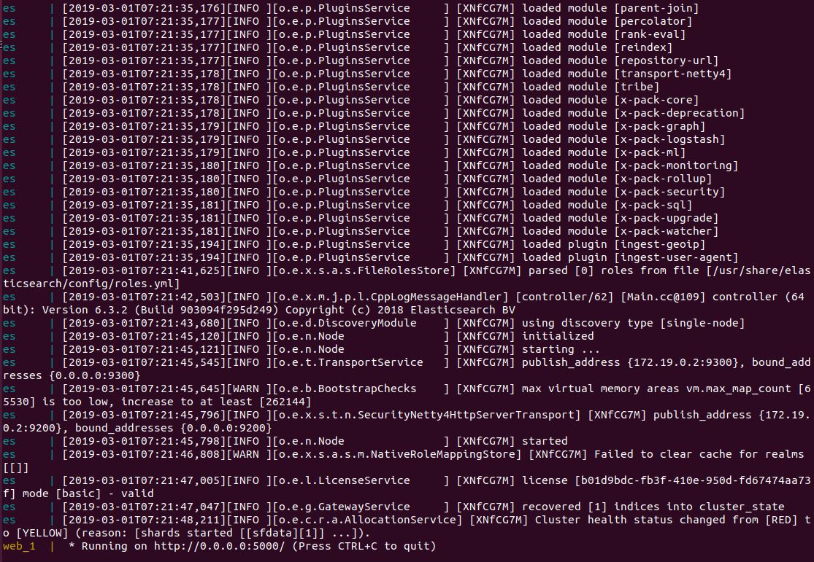
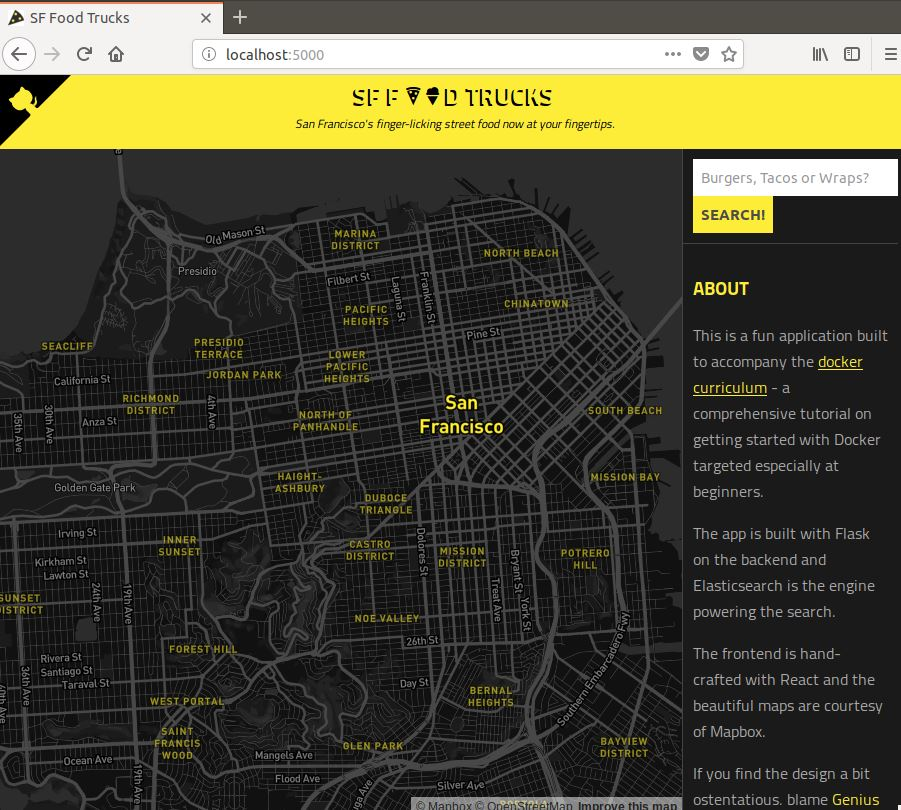

# Docker Compose

## 1. Docker ecosystem
Docker生態系中有許多開源工具，主要有下列四種(本篇是Docker Compose的文章)：
1. [Docker Machine](https://docs.docker.com/machine/) - Create Docker hosts on your computer, on cloud providers, and inside your own data center.
1. [Docker Compose](https://docs.docker.com/compose/) - A tool for defining and running multi-container Docker applications.
1. [Docker Swarm](https://docs.docker.com/swarm/) - A native clustering solution for Docker.
1. [Kubernetes](https://kubernetes.io/) - Kubernetes is an open-source system for automating deployment, scaling, and management of containerized applications.

## 2. Docker Compose
* Compose提供了多容器管理方案，透過docker-compose.yml來設定。下面將會以SF-Foodtrucks(請先參考/docker/docker-network內容)當作範例進行實作。請先安裝docker-compose：
    ```
    $ sudo apt install python-pip
    $ sudo curl -L "https://github.com/docker/compose/releases/download/1.23.2/docker-compose-$(uname -s)-$(uname -m)" -o /usr/local/bin/docker-compose
    $ sudo chmod +x /usr/local/bin/docker-compose
    ```
* 安裝完成後檢查版本。
    ```
    $ docker-compose --version
    docker-compose version 1.23.2, build 1110ad01
    ```
* 下面說明docker-compose.yml內容。可以從services中看到定義了兩個服務es和web，並有各種參數資訊在內。`container_name`相當於啟動指令中`--name`，`environment`對照到`-e`等，`volumes`是儲存資料的位置，更多內容可以參考docker-volumes章節。`depends_on`表示web會在es之後啟動
    ```
    version: "3"
    services:
        es:
            image: docker.elastic.co/elasticsearch/elasticsearch:6.3.2
            container_name: es
            environment:
            - discovery.type=single-node
            ports:
            - 9200:9200
            volumes:
            - esdata1:/usr/share/elasticsearch/data
        web:
            image: nowaxsky/foodtrucks-web
            command: python app.py
            depends_on:
            - es
            ports:
            - 5000:5000
            volumes:
            - ./flask-app:/opt/flask-app
    volumes:
        esdata1:
            driver: local
    ```
* 若還有啟動Flask服務則先停掉，接著執行下列指令啟動docker-compose(啟動前請先修改docker-compose.yml內容的services.web.image，將ID改為自己的Docker hub ID)：
    ```
    $ sudo docker stop $(sudo docker ps -q)
    $ sudo docker rm $(sudo docker ps -aq)
    $ cd FoodTrucks/
    $ sudo docker-compose up
    ```
* 使用瀏覽器拜訪 http://0.0.0.0:5000/ 檢查是否成功啟動服務。


<br>
<br>


* 用`CTRL+C`關閉服務後，改成背景執行：
    ```
    $ sudo docker-compose up -d
    Creating es               ... done
    Creating foodtrucks_web_1 ... done
    $ sudo docker ps
    NAMES              IMAGE                                                 COMMAND                  STATUS      PORTS
    foodtrucks_web_1   nowaxsky/foodtrucks-web                               "python app.py"          Up          0.0.0.0:5000->5000/tcp  
    es                 docker.elastic.co/elasticsearch/elasticsearch:6.3.2   "/usr/local/bin/dock…"   Up          0.0.0.0:9200->9200/tcp, 9300/tcp  
    ```
* 從上面的結果可以看到，名稱將會由docker-compose自行賦予(foodtrucks_web_1是Compose自行賦予，es則在docker-compose.yml有定義)，但目前為止我們不確定這兩個服務是啟動在哪一個network中，或是Compose會自行創建網路。
* 透過下列語法關閉cluster和data volumes：
    ```
    $ sudo docker-compose down -v
    Stopping foodtrucks_web_1 ... done
    Stopping es               ... done
    Removing foodtrucks_web_1 ... done
    Removing es               ... done
    Removing network foodtrucks_default
    Removing volume foodtrucks_esdata1
    ```
* 接著我們再將我們自行建立的網路刪除：
    ```
    $ sudo docker network rm foodtrucks-net
    $ sudo docker network ls
    NETWORK ID          NAME                 DRIVER              SCOPE
    8a966ac57d0c        bridge               bridge              local
    019f31a362c7        host                 host                local
    9edf95a8a628        none                 null                local
    ```
* 重新背景啟動docker-compose，並檢查網路：
    ```
    $ sudo docker-compose up -d
    Creating network "foodtrucks_default" with the default driver
    Creating volume "foodtrucks_esdata1" with local driver
    Creating es ... done
    Creating foodtrucks_web_1 ... done
    $ sudo docker network ls
    NETWORK ID          NAME                 DRIVER              SCOPE
    8a966ac57d0c        bridge               bridge              local
    bb03b8de422c        foodtrucks_default   bridge              local
    019f31a362c7        host                 host                local
    9edf95a8a628        none                 null                local
    ```
* Compose為我們建立一個foodtrucks_default網路，接著檢查這個網路中是否包含兩個服務：
    ```
    $ sudo docker network inspect foodtrucks_default
    [
        {
            "Name": "foodtrucks_default",
            "Id": "71a61b4e5e57713b1b22b14a69d995a2f1d73e5735780137a2f1f8dddb9478d4",
            "Created": "2019-03-01T16:54:24.670560938+08:00",
            "Scope": "local",
            "Driver": "bridge",
            "EnableIPv6": false,
            "IPAM": {
                "Driver": "default",
                "Options": null,
                "Config": [
                    {
                        "Subnet": "172.22.0.0/16",
                        "Gateway": "172.22.0.1"
                    }
                ]
            },
            "Internal": false,
            "Attachable": true,
            "Ingress": false,
            "ConfigFrom": {
                "Network": ""
            },
            "ConfigOnly": false,
            "Containers": {
                "4e2d3163846028838026378d1658f074359c8d7c5c1cff53f059d006910bd363": {
                    "Name": "es",
                    "EndpointID": "24a5d35bd02ac3d561f942f26fb11a86a5d87ebe953d80fc8163ca67a7c99c47",
                    "MacAddress": "02:42:ac:16:00:02",
                    "IPv4Address": "172.22.0.2/16",
                    "IPv6Address": ""
                },
                "a34733383ddbf5f09a8858aacbfb5455ccf79361f9f6ec68e4c13d6e9a2181c7": {
                    "Name": "foodtrucks_web_1",
                    "EndpointID": "1f5acf2d35bf40c612d6826c2105607481bbdb6b56f347228a5a0746f23661a9",
                    "MacAddress": "02:42:ac:16:00:03",
                    "IPv4Address": "172.22.0.3/16",
                    "IPv6Address": ""
                }
            },
            "Options": {},
            "Labels": {
                "com.docker.compose.network": "default",
                "com.docker.compose.project": "foodtrucks",
                "com.docker.compose.version": "1.23.2"
            }
        }
    ]
    ```
* 至此確定兩個服務啟動在同一個由Compose自動建立的network中。

## 3. Development Workflow

* 嘗試拜訪服務如下：
    ```
    $ curl 0.0.0.0:5000/debug
    {
        "msg": "yellow open sfdata Ibkx7WYjSt-g8NZXOEtTMg 5 1 618 0 1.3mb 1.3mb\n",
        "status": "success"
    }
    ```
* `/debug`路徑可以拜訪是因為在flask-app/app.py中有定義，如果想要再增加`/hello`路徑的話該怎麼做？下面嘗試直接在app.py中修改程式：
    ```py
    @app.route('/')
    def index():
        return render_template("index.html")

    # add a new hello route
    @app.route('/hello')
    def hello():
        return "hello world!"
    ```
* 接下來拜訪接口：
    ```
    $ curl -I 0.0.0.0:5000/hello
    HTTP/1.0 404 NOT FOUND
    Content-Type: text/html
    Content-Length: 233
    Server: Werkzeug/0.11.2 Python/2.7.15rc1
    Date: Fri, 01 Mar 2019 09:09:44 GMT
    ```
* 仍然無法拜訪到該接口，因為修改的是原始的程式碼，但拜訪的是舊程式碼所建出image的容器，該image並沒有被修改。所以需要透過修改docker-compose.yml來解決。設定`DEBUG=True`當app.py一有變化則server會立刻reload。另外服務建立有兩種方式，第一種是image，第二種是build。build需要給予Dockerfile所在位置的路徑。

    ```
    version: "3"
    services:
        es:
            image: docker.elastic.co/elasticsearch/elasticsearch:6.3.2
            container_name: es
            environment:
            - discovery.type=single-node
            ports:
            - 9200:9200
            volumes:
            - esdata1:/usr/share/elasticsearch/data
        web:
            build: . # replaced image with build
            command: python app.py
            environment:
            - DEBUG=True  # set an env var for flask
            depends_on:
            - es
            ports:
            - 5000:5000
            volumes:
            - ./flask-app:/opt/flask-app
    volumes:
        esdata1:
            driver: local
    ```
* 重新下上服務：
    ```
    $ sudo docker-compose down -v
    $ sudo docker-compose up -d
    ```
* 重新拜訪：
    ```
    $ curl 0.0.0.0:5000/hello
    hello world!
    ```
* 請再自行測試各種改變，看看容器是否能及時對應。
