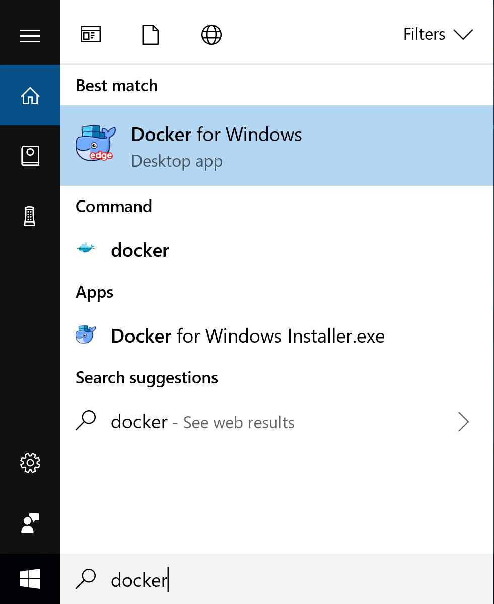
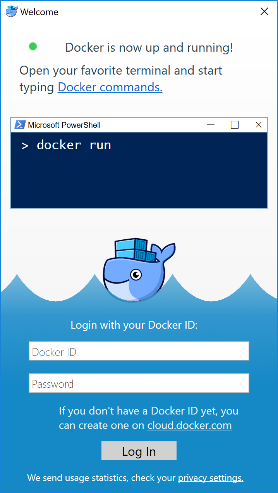

# Docker Swarm

## 1. Container Orchestration System

想像今天有上百個容器正在執行，我們需要確認每個容器的狀態和管理每個容器是非常複雜的，下列幾項事情是我們所關心的：

1. 每個容器的健康程度
1. 對於一個特定image啟動了多少的容器
1. 根據流量做scale up或scale down
1. 如何對每個容器進行更新
1. ...

Docker Swarm就是要解決容器管理的問題。

## 1. Docker Machine

* Docker Machine是安裝Docker Engine在VM上的工具，但[VM不支援巢狀VM](https://superuser.com/questions/1138980/this-computer-doesnt-have-vt-x-amd-v-enabled-enabling-it-in-the-bios-is-mandat)，所以無法在一個VM中運行另一個VM，故如果是將Linux安裝VM中則不能在上面安裝建立machine(但依然可以安裝docker-machine)。下面範例是將Docker Machine安裝在Windows環境中。

## 2. Install Docker Desktop for Windows

* 請先到官網[下載](https://download.docker.com/win/stable/Docker%20for%20Windows%20Installer.exe)Docker，桌面版將包含Docker Engine、Docker CLI client、Docker Compose、Docker Machine、和Kitematic。接下來直接進行安裝。

    

* 安裝完成後會需要登出，重新登入後會跳出下列訊息要求重開機，請點選OK。

    

* 重新啟動後已經完成安裝設定，可以從開始搜尋到Docker for Windows，或是螢幕右
下角也會顯示Docker。

    
    <br>
    <br>
    

* 安裝完成後會自動跳出登入畫面，請輸入您在Docker hub上面的帳號。

    

* 接下來請打開cmd並輸入下列語法檢查版本以確認安裝成功。
    ```
    $ docker --version
    Docker version 18.09.2, build 6247962
    ```
* __Docker桌面版至此安裝成功，若您是使用Linux安裝Docker，請繼續執行下列兩步驟__ 。因為Docker桌面版已經含有Docker Machine，如果是Linux環境則需要另外安裝Docker Machine，請輸入下列指令：
    ```
    base=https://github.com/docker/machine/releases/download/v0.16.0 &&
  curl -L $base/docker-machine-$(uname -s)-$(uname -m) >/tmp/docker-machine &&
  sudo install /tmp/docker-machine /usr/local/bin/docker-machine
    ```
* 接下來在ubuntu安裝virtualbox：
    ```
    $ sudo apt-get install virtualbox 
    ```

## 3. Microsoft Hyper-V

1. __如果您不是使用Windows環境可以直接跳過這段。__
1. 請先從開始搜尋Hyper-V Manager，並打開如下。

    

1. 請點選右邊動作(Actions)列中的虛擬交換器管理員(Virtual Switch Manager)，並點選新虛擬網路交換器(new virtual network switch)，選擇 __外部(external)__ ，之後點選建立虛擬交換器。

    

1. 將虛擬交換器命名為Primary Virtual Switch，並在連線類型(Connection type)的外部網路(External network)中，使用下拉式選單選擇網路，並允許管理作業系統共用此網路介面卡(Allow management operating system to share this network adapter)，套用後按下確定。

    

1. 重新啟動電腦。
1. 啟動cmd(本文若無特別說明都需要以系統管理員身分啟動)並輸入下列語法建立machine：
    ```
    $ docker-machine create --driver hyperv default
    ```
    

* 下列語法可以查看所有的machine，確定啟動成功：
    ```
    $ docker-machine ls
    NAME      ACTIVE   DRIVER   STATE     URL                          SWARM   DOCKER     ERRORS
    default   -        hyperv   Running   tcp://192.168.100.116:2376           v18.09.3
    ```

## 3. Docker Machine

* 使用下列語法建立4台machine，請注意Windows是使用hyperv的虛擬化技術，Mac則是使用virtualbox，若您是使用Mac請將`--driver hyperv`替換為`--driver virtualbox`：
    ```
    $ docker-machine create --driver hyperv manager1
    $ docker-machine create --driver hyperv worker1
    $ docker-machine create --driver hyperv worker2
    $ docker-machine create --driver hyperv worker3
    ```
* 查看所有的machine：
    ```
    $ docker-machine ls
    NAME       ACTIVE   DRIVER   STATE     URL                          SWARM   DOCKER     ERRORS
    default    -        hyperv   Running   tcp://192.168.100.116:2376           v18.09.3
    manager1   -        hyperv   Running   tcp://192.168.100.117:2376           v18.09.3
    worker1    -        hyperv   Running   tcp://192.168.100.118:2376           v18.09.3
    worker2    -        hyperv   Running   tcp://192.168.100.119:2376           v18.09.3
    worker3    -        hyperv   Running   tcp://192.168.100.121:2376           v18.09.3
    ```
* 透過下列指令可以查看managere1的IP，我們暫時將之命名為 __manager IP__ ，稍後將會使用到：
    ```
    $ docker-machine ip mananger1
    192.168.100.117
    ```
* 接下來可以透過`docker-machine ssh [machine name]`建立ssh連線到指定的machine，下面指令將連線到manager1。
    ```
    $ docker-machine ssh manager1
    ```

    

## 4. 加入 Swarm

* 將manager1加入swarm，請將`192.168.100.117`替換為您的 __manager IP__ 。
    ```
    docker@manager1:~$ docker swarm init --advertise-addr 192.168.100.117
    Swarm initialized: current node (iohc8ovycsju9xgrmxrkbwf4j) is now a manager.

    To add a worker to this swarm, run the following command:

        docker swarm join --token SWMTKN-1-1l3x2hbbdq0fx4lc3a00312tubzvno1zx4bg42qx8cp31jzhe5-67tj5gh2e1szo6o4thuptwiyu 192.168.100.117:2377

    To add a manager to this swarm, run 'docker swarm join-token manager' and follow the instructions.
    ```
* 透過下列語法可以看到Swarm的狀態，manager1是Leader：
    ```
    docker@manager1:~$ docker node ls
    ID                            HOSTNAME            STATUS              AVAILABILITY        MANAGER STATUS      ENGINE VERSION
    iohc8ovycsju9xgrmxrkbwf4j *   manager1            Ready               Active              Leader              18.09.3
    ```
* 可以透過下列指令，取得如何將manager或worker加入該swarm的方法：
    ```
    docker@manager1:~$ docker swarm join-token worker
    To add a worker to this swarm, run the following command:

        docker swarm join --token SWMTKN-1-1l3x2hbbdq0fx4lc3a00312tubzvno1zx4bg42qx8cp31jzhe5-67tj5gh2e1szo6o4thuptwiyu 192.168.100.117:2377
    
    docker@manager1:~$ docker swarm join-token manager
    To add a manager to this swarm, run the following command:

        docker swarm join --token SWMTKN-1-1l3x2hbbdq0fx4lc3a00312tubzvno1zx4bg42qx8cp31jzhe5-4rn29om9y8fgrztez8pxdrejo 192.168.100.117:2377
    ```
* 啟動另一個cmd並輸入下列指令連線到worker1，並輸入剛才查詢的指令，以worker的身分加入Swarm。
    ```
    $ docker-machine ssh worker1
    docker@worker1:~$ docker swarm join --token SWMTKN-1-1l3x2hbbdq0fx4lc3a00312tubzvno1zx4bg42qx8cp31jzhe5-67tj5gh2e1szo6o4thuptwiyu 192.168.100.117:2377
    This node joined a swarm as a worker.
    ```
* 接下來將剩下2台machine都加入manager1，最後在manager1中查詢是否成功添加：
    ```
    docker@manager1:~$ docker node ls
    ID                            HOSTNAME            STATUS              AVAILABILITY        MANAGER STATUS      ENGINE VERSION
    iohc8ovycsju9xgrmxrkbwf4j *   manager1            Ready               Active              Leader              18.09.3
    k1r2ylxrixcor9klrp2qrpedg     worker1             Ready               Active                                  18.09.3
    sm8rrce0mqe7x1k10kwk84j4b     worker2             Ready               Active                                  18.09.3
    js90toi1l7fjhx7hp3e7dr86u     worker3             Ready               Active                                  18.09.3
    ```

## 5. 建立服務

* 下面將使用官方的 __nginx__ 服務來進行示範，並將對外的port設為80。透過下列指令在manager1中一次建立3個nginx。
    ```
    docker@manager1:~$ docker service create --replicas 3 -p 80:80 --name web nginx
    n2566ad8qya360l29cdhxkop1
    overall progress: 3 out of 3 tasks
    1/3: running   [==================================================>]
    2/3: running   [==================================================>]
    3/3: running   [==================================================>]
    verify: Service converged
    ```
* 透過下列指令可以查看狀態：
    ```
    docker@manager1:~$ docker service ls
    ID                  NAME                MODE                REPLICAS            IMAGE               PORTS
    n2566ad8qya3        web                 replicated          3/3                 nginx:latest        *:80->80/tcp
    docker@manager1:~$ docker service ps web
    ID                  NAME                IMAGE               NODE                DESIRED STATE       CURRENT STATE                ERROR               PORTS
    fn9t2ru8szfp        web.1               nginx:latest        worker3             Running             Running about a minute ago
    m9zz00m6p47l        web.2               nginx:latest        manager1            Running             Running about a minute ago
    murgwrtinkp4        web.3               nginx:latest        worker1             Running             Running 2 minutes ago
    ```
* 從上面可以看到，這個服務被分配到manager1、worker1、和worker3，worker2並沒有被分配到。接著使用下列指令確定服務已經啟動。
    ```
    docker@manager1:~$ docker ps
    CONTAINER ID        IMAGE               COMMAND                  CREATED             STATUS              PORTS               NAMES
    dafa5b5650bb        nginx:latest        "nginx -g 'daemon of…"   4 minutes ago       Up 4 minutes        80/tcp              web.2.m9zz00m6p47lgag2s9sj1d3fl
    ```
* 可以在cmd中下curl來拜訪服務，或是直接在瀏覽器上輸入服務位置，可以透過指令`docker-machine ls`查詢IP位置。

    
    <br>
    <br>
    

* 注意，`192.168.100.119`是worker2的IP，雖然沒有服務啟動，但Swarm已經自動幫我們做了Load Balance。

## 6. Scaling up/down

* 接下來將服務擴展到8個，請在manager1輸入下列指令：
    ```
    docker@manager1:~$ docker service scale web=8
    web scaled to 8
    overall progress: 8 out of 8 tasks
    1/8: running   [==================================================>]
    2/8: running   [==================================================>]
    3/8: running   [==================================================>]
    4/8: running   [==================================================>]
    5/8: running   [==================================================>]
    6/8: running   [==================================================>]
    7/8: running   [==================================================>]
    8/8: running   [==================================================>]
    verify: Service converged
    ```
* 完成後可以透過下列指令查看服務狀態：
    ```
    docker@manager1:~$ docker service ps web
    ID                  NAME                IMAGE               NODE                DESIRED STATE       CURRENT STATE                ERROR               PORTS
    fn9t2ru8szfp        web.1               nginx:latest        worker3             Running             Running 20 minutes ago
    m9zz00m6p47l        web.2               nginx:latest        manager1            Running             Running 20 minutes ago
    murgwrtinkp4        web.3               nginx:latest        worker1             Running             Running 20 minutes ago
    3b6bsizi5n5a        web.4               nginx:latest        manager1            Running             Running about a minute ago
    i0khzg18gk01        web.5               nginx:latest        worker2             Running             Running about a minute ago
    47ara77ab6zt        web.6               nginx:latest        worker2             Running             Running about a minute ago
    rl6npfjurep6        web.7               nginx:latest        worker3             Running             Running about a minute ago
    jco895dua74j        web.8               nginx:latest        worker1             Running             Running about a minute ago
    ```
* 也可以將服務數目減少，下面指令將服務減少到6個：
    ```
    docker@manager1:~$ docker service scale web=6
    web scaled to 6
    overall progress: 6 out of 6 tasks
    1/6: running   [==================================================>]
    2/6: running   [==================================================>]
    3/6: running   [==================================================>]
    4/6: running   [==================================================>]
    5/6: running   [==================================================>]
    6/6: running   [==================================================>]
    verify: Service converged
    docker@manager1:~$ docker service ps web
    ID                  NAME                IMAGE               NODE                DESIRED STATE       CURRENT STATE            ERROR               PORTS
    1rh94p566g91        web.1               nginx:latest        worker1             Running             Running 11 seconds ago
    k5pi57zumhta        web.2               nginx:latest        worker3             Running             Running 11 seconds ago
    kl6sle4ujjur        web.3               nginx:latest        manager1            Running             Running 11 seconds ago
    ayfswtmi8m57        web.4               nginx:latest        worker1             Running             Running 11 seconds ago
    ya9j19p4jbeo        web.5               nginx:latest        worker3             Running             Running 11 seconds ago
    qzyp4s68saik        web.6               nginx:latest        manager1            Running             Running 11 seconds ago
    ```
* 可以透過下列指令查看當前節點的狀態：
    ```
    docker@manager1:~$ docker node inspect self
    ```
* 如果要查看其他節點的狀態需要輸入該節點的名稱：
    ```
    docker@manager1:~$ docker node inspect worker1
    ```

## 7. Draining nodes

* 如果節點`AVAILABILITY`是`Active`，則表示節點可以接收manager(master)的任務，但有時候需要讓節點維護而下線，需要將節點`AVAILABILITY`設為`Drain`。檢查worker1的狀態：
    ```
    docker@manager1:~$ docker node ps worker1
    ID                  NAME                IMAGE               NODE                DESIRED STATE       CURRENT STATE           ERROR               PORTS
    1rh94p566g91        web.1               nginx:latest        worker1             Running             Running 2 minutes ago               
    ayfswtmi8m57        web.4               nginx:latest        worker1             Running             Running 2 minutes ago        
    ```
* 檢查worker1狀態細節：
    ```
    docker@manager1:~$ docker node inspect worker1
    ...
    "Status": {
            "State": "ready",
            "Addr": "192.168.100.118"
        }
    ...
    ```
* 透過下列指令將worker1的`AVAILABILITY`設為Drain：
    ```
    docker@manager1:~$ docker node update --availability drain worker1
    worker1
    ```
* 重新檢查服務，可以發現web.1和web.4確實處於Shutdown狀態，但Swarm卻立刻讓其他節點來支援服務，web.1由worker3支援，web.4由manager1支援，所以仍然維持6個服務。
    ```
    docker@manager1:~$ docker service ps web
    ID                  NAME                IMAGE               NODE                DESIRED STATE       CURRENT STATE             ERROR               PORTS
    u1qeht8cvlz7        web.1               nginx:latest        worker3             Running             Running 19 seconds ago              
    1rh94p566g91         \_ web.1           nginx:latest        worker1             Shutdown            Shutdown 19 seconds ago             
    k5pi57zumhta        web.2               nginx:latest        worker3             Running             Running 4 minutes ago               
    kl6sle4ujjur        web.3               nginx:latest        manager1            Running             Running 4 minutes ago               
    cbsd9k9zg4ts        web.4               nginx:latest        manager1            Running             Running 19 seconds ago              
    ayfswtmi8m57         \_ web.4           nginx:latest        worker1             Shutdown            Shutdown 19 seconds ago             
    ya9j19p4jbeo        web.5               nginx:latest        worker3             Running             Running 4 minutes ago               
    qzyp4s68saik        web.6               nginx:latest        manager1            Running             Running 4 minutes ago     
    ```
* 如果在服務的過程中，需要更新升級image，可以透過下列語法讓所有節點升級：
    ```
    docker@manager1:~$ docker service update --image [image name]:[version] web
    ```
* 最後請刪除所有服務：
    ```
    docker@manager1:~$ docker service rm web
    web
    ```
