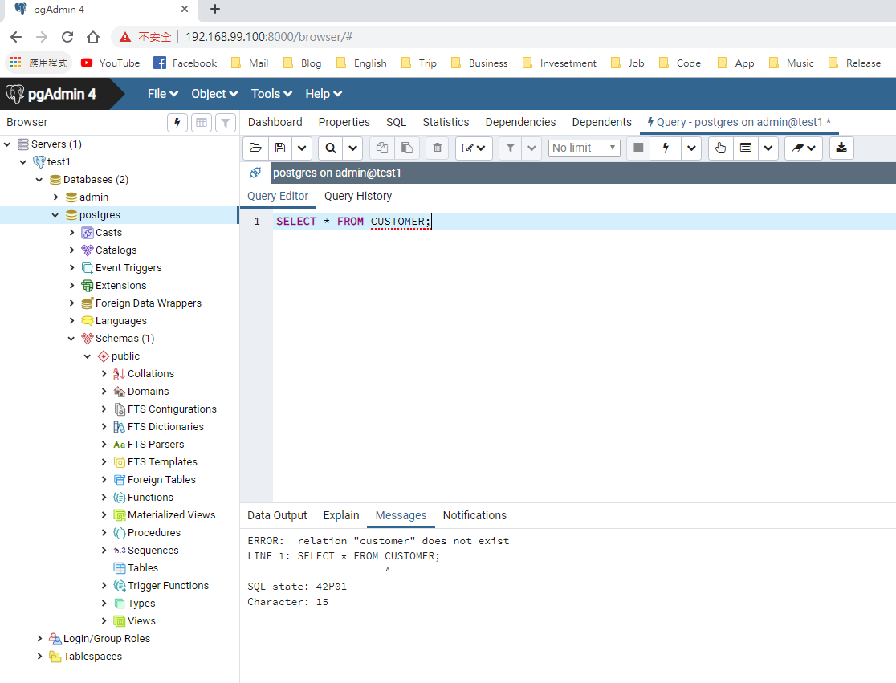

# PostgreSQL with Docker

## 1. 安裝

* 建立 Volume，如果您是 Linux 可以跳過本步驟。
    ```
    $ docker volume create --name postgresql-volume -d local
    postgresql-volume
    ```
* 下載最新版 postgres 並執行 container。`/var/lib/postgresql/data` 路徑是 PostgresSQL 新增的資料寫在 container 內的目錄。若您是 Linux 可以直接指定本機端的目錄作為 Volume 使用，例如：`-v /postgres/data:/var/lib/postgresql/data`。但如果是使用 Windows 或是 Mac 環境要掛載本機端目錄進去時會因為權限不足發生錯誤，所以要用已經建立好的 Volume 掛載到容器內，語法如下：
    ```
    $ docker run --name mypostgres -d -p 5432:5432 -v postgresql-volume:/var/lib/postgresql/data -e POSTGRES_USER=admin -e POSTGRES_PASSWORD='0000' postgres:latest
    2f0a06dd630c8d10ebb6e00ff5253bd634107959082ec357be64ff5c00d59776
    $ docker ps
    CONTAINER ID        IMAGE               COMMAND                  CREATED             STATUS              PORTS                    NAMES
    2f0a06dd630c        postgres:latest     "docker-entrypoint.s…"   17 seconds ago      Up 12 seconds       0.0.0.0:5432->5432/tcp   mypostgres
    ```
* 以下指令可以直接進入資料庫下各種語法。`-U admin` 是以哪個帳號登入，即是上一步驟建立容器時的帳號進行登入。跳出密碼提示時輸入 `0000` 即可登入。登入後可以透過指令 `\q` 離開。
    ```
    $ docker run -it --rm --link mypostgres:postgres postgres psql -h postgres -U admin
    Password for user admin:
    psql (11.2 (Debian 11.2-1.pgdg90+1))
    Type "help" for help.

    admin=# \q
    $
    ```

## 2. pgAdmin4

* 由於 pgAdmin 沒有 docker 官方版本，這裡使用 dpage/pgadmin4，啟動語法如下。`--link [postgres name]:[host name]` 請輸入您剛才建立 postgres 使用的名稱和 host name (範例使用 postgres)，筆者使用的是 `mypostgres`。
    ```
    $ docker run --name mypgadmin --link mypostgres:postgres -p 80:80 -e "PGADMIN_DEFAULT_EMAIL=cpm.chuck@gmail.com" -e "PGADMIN_DEFAULT_PASSWORD=12345" -d dpage/pgadmin4
    7f5a5a6caf8dcece95d8572d7009d80a93f217524f1244421977f059991788de
    $ docker ps
    CONTAINER ID        IMAGE               COMMAND                  CREATED             STATUS              PORTS                         NAMES
    7f5a5a6caf8d        dpage/pgadmin4      "/entrypoint.sh"         16 seconds ago      Up 11 seconds       0.0.0.0:80->80/tcp, 443/tcp   mypgadmin
    2f0a06dd630c        postgres:latest     "docker-entrypoint.s…"   2 minutes ago       Up 2 minutes        0.0.0.0:5432->5432/tcp        mypostgres
    ```
* 接下來查詢 docker-machine 對外的 IP：
    ```
    $ docker-machine ip
    192.168.99.100
    ```
* 拜訪瀏覽器 IP：http://192.168.99.100，並輸入剛才設定的 email 和密碼即可登入。
    
    
    <br>
    <br>
    
* 請點選 Add New Server 建立 Server。General 可以命名 Server 的名稱，Connection 中的 Host name 要輸入您建立 postgres 時使用 host name，並輸入帳號密碼即可建立。

    
    <br>
    <br>
    
* 連線成功。

    

## 3. 保存資料

* 本節將測試 PostgreSQL 容器內的資料保存機制，重點摘要如下：
    1. 資料的異動映像檔 __無法__ 保存。(這裡指的資料是 table 和裡面的 data)
    1. 資料保存在 Volume 中，透過掛載可以讓不同的映像檔取得資料。
* 請執行 `create-table-customer.sql` 的內容並且 commit，確定成功產生 table。

    
* 執行 `insert-table-customer.sql` 並且查詢是否新增2筆資料。

    
* 接下來利用 `docker commit` 建立映像檔。`-m` 參數後面放入要記錄的訊息，`-a` 是紀錄更新者，`2f0a06dd630c` 是 `mypostgres`容器的 ID，請替換為您的容器 ID。最後再加上您的 Docker hub 帳戶名和專案名稱。建立成功後查看映像檔是否出現。
    ```
    $ docker ps
    CONTAINER ID        IMAGE               COMMAND                  CREATED             STATUS              PORTS                         NAMES
    7f5a5a6caf8d        dpage/pgadmin4      "/entrypoint.sh"         16 seconds ago      Up 11 seconds       0.0.0.0:80->80/tcp, 443/tcp   mypgadmin
    2f0a06dd630c        postgres:latest     "docker-entrypoint.s…"   2 minutes ago       Up 2 minutes        0.0.0.0:5432->5432/tcp        mypostgres
    $ docker commit -m "create customer" -a "Chuck Mai" 2f0a06dd630c nowaxsky/postgres-customer
    sha256:85a00fb113e353c2a67557019f0222d8dd38a6c79877c93814d27419f947789a
    $ docker images
    REPOSITORY                         TAG                 IMAGE ID            CREATED             SIZE
    nowaxsky/postgres-customer         latest              85a00fb113e3        18 seconds ago      312MB
    ...
    ```
* 接下來請將 mypostgres 和 mypgadmin 停掉，並刪除所有容器。
    ```
    $ docker stop mypostgres mypgadmin
    mypostgres
    mypgadmin
    $ docker rm $(docker ps -aq)
    7f5a5a6caf8d
    2f0a06dd630c
    ```
* 接下來進行測試，先執行剛才建立好的映像檔，並將容器命名為 postgres1，但不掛載 volume。再啟動第二個容器命名為 postgres2 且掛載 volume。
    ```
    $ docker run --name postgres1 -d -p 5431:5432 -v /var/lib/postgresql/data -e POSTGRES_USER=admin -e POSTGRES_PASSWORD='0000' nowaxsky/postgres-customer
    eec19991ee8121025d74f3294ad843b8dfc5a388de134005ec85fe1aa5d56ac6
    $ docker run --name postgres2 -d -p 5432:5432 -v postgresql-volume:/var/lib/postgresql/data -e POSTGRES_USER=admin -e POSTGRES_PASSWORD='0000' nowaxsky/postgres-customer
    1d0217e1b44960b71bd3b23caba7b455d89f88f5c21949174008c90364a132f1
    $ docker ps
    CONTAINER ID        IMAGE                        COMMAND                  CREATED             STATUS              PORTS                    NAMES
    1d0217e1b449        nowaxsky/postgres-customer   "docker-entrypoint.s…"   25 seconds ago      Up 19 seconds       0.0.0.0:5432->5432/tcp   postgres2
    eec19991ee81        nowaxsky/postgres-customer   "docker-entrypoint.s…"   54 seconds ago      Up 49 seconds       0.0.0.0:5431->5432/tcp   postgres1
    ```
* 建立兩個 pgAdmin，一個連結到 postgres1，另一個連結到 postgres2。
    ```
    $ docker run --name mypgadmin1 --link postgres1:postgres -p 8000:80 -e "PGADMIN_DEFAULT_EMAIL=cpm.chuck@gmail.com" -e "PGADMIN_DEFAULT_PASSWORD=12345" -d dpage/pgadmin4
    fdfc0d0dc739d997bba81f9ccea48e3d1febce9dd580dab8f93d205dc10bd68b
    $ docker run --name mypgadmin2 --link postgres2:postgres -p 80:80 -e "PGADMIN_DEFAULT_EMAIL=cpm.chuck@gmail.com" -e "PGADMIN_DEFAULT_PASSWORD=12345" -d dpage/pgadmin4
    873ff979956c1e3bf46ea616839154897f86b5fff46e7ee78e61683f8ed1b4e6
    $ docker ps
    CONTAINER ID        IMAGE                        COMMAND                  CREATED             STATUS              PORTS                           NAMES
    873ff979956c        dpage/pgadmin4               "/entrypoint.sh"         9 minutes ago       Up 9 minutes        0.0.0.0:80->80/tcp, 443/tcp     mypgadmin2
    fdfc0d0dc739        dpage/pgadmin4               "/entrypoint.sh"         9 minutes ago       Up 9 minutes        443/tcp, 0.0.0.0:8000->80/tcp   mypgadmin1
    1d0217e1b449        nowaxsky/postgres-customer   "docker-entrypoint.s…"   12 minutes ago      Up 12 minutes       0.0.0.0:5432->5432/tcp          postgres2
    eec19991ee81        nowaxsky/postgres-customer   "docker-entrypoint.s…"   12 minutes ago      Up 12 minutes       0.0.0.0:5431->5432/tcp          postgres1
    ```
* 使用瀏覽器拜訪 docker-machine IP 的 80 和 8000 port，連線結果是不使用 volume 是無法取得資料的，即便使用了 `docker commit` 指令也無法將資料寫入映像檔，建議讀者可以自行測試第一次啟動時就完全不指定 Volume ，讓系統自動產生，接著修改資料後 `docker commit` 也同樣無法保存資料。第二個測試就是掛載了 Volume 所以可以正確取得資料。
    
    
    <br>
    <br>
    

## 4. 資料初始化

* 如果要將變動過後的資料備份後再移動，在 Windows 或 Linux 環境下可能無法成功，因為沒有拜訪許可的權限，導致無法成功產生備份檔案。若為 Linux 環境可以參考相關文章：[Backup/Restore a dockerized PostgreSQL database](https://stackoverflow.com/questions/24718706/backup-restore-a-dockerized-postgresql-database)，[How to backup a PostgreSQL database using Docker](https://devopsheaven.com/postgresql/pg_dump/databases/docker/backup/2017/09/10/backup-postgresql-database-using-docker.html)。
* 若是在 Windows 或 Linux 環境下可以考慮一開始產生映像檔時就建立好 table 和 data，如此也能將建立的環境帶到其他地方，不倚賴更改後的備份或是 Volume，本節將示範如何將資料初始化在映像檔中。

    