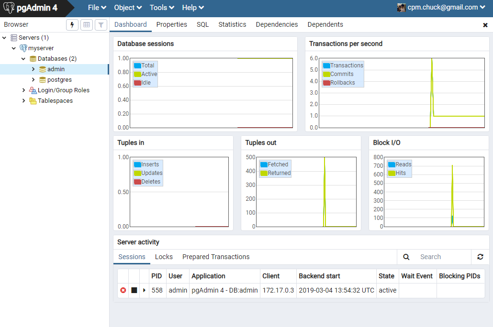

# PostgreSQL with Docker

## 1. 安裝

* 下載最新版 postgres 並執行 container。`-v /var/lib/postgresql/data` 路徑是 PostgresSQL 新增的資料寫在 container 內的目錄，注意如果是使用 Windows 或是 Mac 環境要掛載本機端目錄進去時會因為權限不足發生錯誤，解決方法待研究。
    ```
    $ docker run --name mypostgres -d -p 5432:5432 -v /var/lib/postgresql/data -e POSTGRES_USER=admin -e POSTGRES_PASSWORD='0000' postgres:latest
    b8509482efb161781eb562e61fcef84bebade75d084fa1f832fd2320350d8ce7
    $ docker ps
    CONTAINER ID        IMAGE               COMMAND                  CREATED             STATUS              PORTS                    NAMES
    b8509482efb1        postgres:latest     "docker-entrypoint.s…"   12 seconds ago      Up 8 seconds        0.0.0.0:5432->5432/tcp   mypostgres
    ```
* 以下指令可以直接進入資料庫下各種語法。`-U admin` 是以哪個帳號登入，即是上一步驟建立容器時的帳號進行登入。跳出密碼提示時輸入 `0000` 即可登入。
    ```
    $ docker run -it --rm --link mypostgres:postgres postgres psql -h postgres -U admin
    Password for user admin:
    psql (11.2 (Debian 11.2-1.pgdg90+1))
    Type "help" for help.

    admin=#
    ```

## 2. pgAdmin4

* 由於 pgAdmin 沒有 docker 官方版本，這裡使用 dpage/pgadmin4，啟動語法如下。`--link [postgres name]:[host name]` 請輸入您剛才建立 postgres 使用的名稱和 host name (範例使用 postgres)，筆者使用的是 `mypostgres`。
    ```
    $ docker run --name mypgadmin --link mypostgres:postgres -p 80:80 -e "PGADMIN_DEFAULT_EMAIL=cpm.chuck@gmail.com" -e "PGADMIN_DEFAULT_PASSWORD=12345" -d dpage/pgadmin4
    13cf0a39c94552060f3d5bcff3069312033f9f1cfb1183a6a0e31d8816b91da4
    $ docker ps
    CONTAINER ID        IMAGE               COMMAND                  CREATED              STATUS              PORTS                         NAMES
    13cf0a39c945        dpage/pgadmin4      "/entrypoint.sh"         About a minute ago   Up 59 seconds       0.0.0.0:80->80/tcp, 443/tcp   mypgadmin
    b8509482efb1        postgres:latest     "docker-entrypoint.s…"   3 hours ago          Up 3 hours          0.0.0.0:5432->5432/tcp        mypostgres
    ```
* 接下來查詢 docker-machine 對外的 IP：
    ```
    $ docker-machine ip
    192.168.99.100
    ```
* 拜訪瀏覽器 IP：http://192.168.99.100，並輸入剛才設定的 email 和密碼即可登入。
    
    
    <br>
    <br>
    
* 請點選 Add New Server 建立 Server。General 可以命名 Server 的名稱，Connection 中的 Host name 要輸入您建立 postgres 時使用 host name，並輸入帳號密碼即可建立。

    
    <br>
    <br>
    
* 連線成功。

    

## 3. Docker Commit

* 本節示範如何新增一個 table，並把改變後的 PostgreSQL 做成映像檔。
* 請執行 `create-table-customer.sql` 的內容並且 commit，確定成功產生 table。

    
* 執行 `insert-table-customer.sql` 並且查詢是否新增2筆資料。

    
* 接下來利用 `docker commit` 建立映像檔。`-m` 參數後面放入要記錄的訊息，`-a` 是紀錄更新者，`b8509482efb1` 是 `mypostgres`容器的 ID，請替換為您的容器 ID。最後再加上您的 Docker hub 帳戶名和專案名稱。建立成功後查看映像檔是否出現。
    ```
    $ docker ps
    CONTAINER ID        IMAGE               COMMAND                  CREATED             STATUS              PORTS                         NAMES
    13cf0a39c945        dpage/pgadmin4      "/entrypoint.sh"         3 hours ago         Up 3 hours          0.0.0.0:80->80/tcp, 443/tcp   mypgadmin
    b8509482efb1        postgres:latest     "docker-entrypoint.s…"   6 hours ago         Up 6 hours          0.0.0.0:5432->5432/tcp        mypostgres
    $ docker commit -m "create table customer" -a "Chuck Mai" b8509482efb1 nowaxsky/postgres-create-table
    sha256:4f8a88037e3decd599bd644a836767f31b61a5159d0f2f59e56f77d96d7a498e
    $ docker images
    REPOSITORY                         TAG                 IMAGE ID            CREATED             SIZE
    nowaxsky/postgres-create-table     latest              4f8a88037e3d        14 seconds ago      312MB
    ...
    ```
* 接下來請將 mypostgres 和 mypgadmin 停掉，並刪除所有容器。
    ```
    $ docker stop mypostgres mypgadmin
    mypostgres
    mypgadmin
    $ docker rm $(docker ps -aq)
    13cf0a39c945
    b8509482efb1
    741a6e46390a
    9eaf364ef800
    ```
* 啟動剛才建立好的映像檔。
    ```
    $ docker run --name nowaxsky-postgres -d -p 5432:5432 -v /var/lib/postgresql/data -e POSTGRES_USER=admin -e POSTGRES_PASSWORD='0000' nowaxsky/postgres-create-table
    f08bb6892a3746bda2278365c864f2d553f61ce5b477cde8ab2b589f147261b4
    ```
* 重新建立並啟動 pgAdmin。
    ```
    $ docker run --name mypgadmin --link nowaxsky-postgres:postgres -p 80:80 -e "PGADMIN_DEFAULT_EMAIL=cpm.chuck@gmail.com" -e "PGADMIN_DEFAULT_PASSWORD=12345" -d dpage/pgadmin4
    d67ad767df22e220e8c4325a71bb356e37be318bc6b705e613d0d3346c663a7f
    $ docker ps
    CONTAINER ID        IMAGE                            COMMAND                  CREATED             STATUS              PORTS                         NAMES
    d67ad767df22        dpage/pgadmin4                   "/entrypoint.sh"         8 seconds ago       Up 4 seconds        0.0.0.0:80->80/tcp, 443/tcp   mypgadmin
    f08bb6892a37        nowaxsky/postgres-create-table   "docker-entrypoint.s…"   2 minutes ago       Up 2 minutes        0.0.0.0:5432->5432/tcp        nowaxsky-postgres
    ```
* 使用瀏覽器拜訪 docker-machine IP 並輸入帳號密碼。接下來建立和資料庫的連線。
    
    
    <br>
    <br>
    