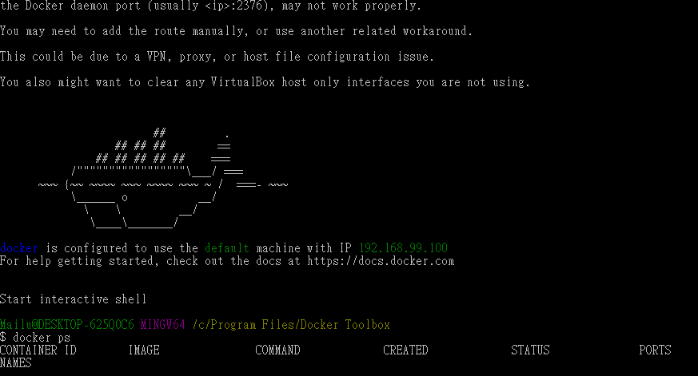
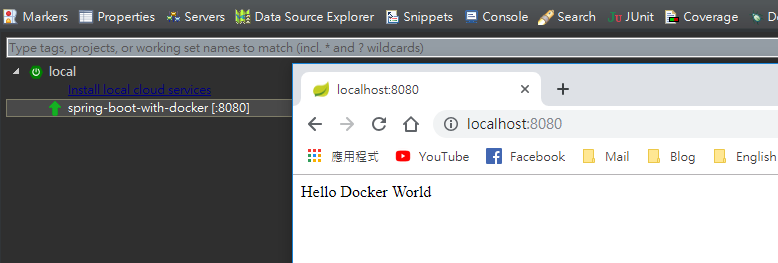
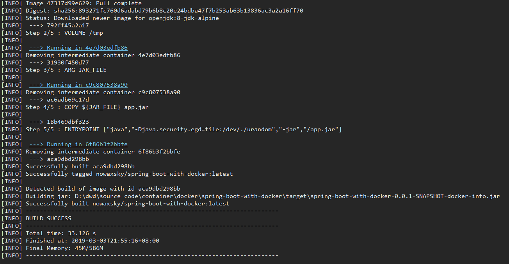
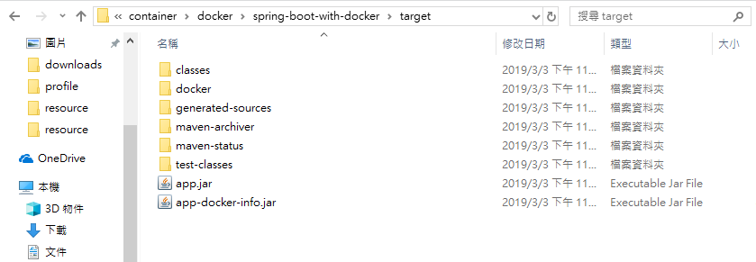
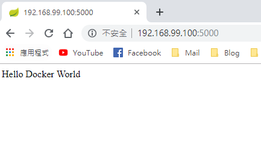

# Spring Boot with Docker

## 1. Spring boot 設定

* 需要在 `pom.xml` 中加入關於docker相關的設定。在參數中增加docker的前綴 `docker.image.prefix`，即您在 Docker hub 上的 ID。另外增加 plugin 如下，若您不需要產生 jar 檔，可以將 `buildArgs` 參數拿掉。 `build` 底下新增 `finalName` 來控制 jar 檔的名稱，不放入則會直接產生檔案 `spring-boot-with-docker-0.0.1-SNAPSHOT.jar`。
    ```xml
    <properties>
        <docker.image.prefix>nowaxsky</docker.image.prefix>
    </properties>
    <build>
        <finalName>app</finalName>
        <plugins>
            <plugin>
                <groupId>org.springframework.boot</groupId>
                <artifactId>spring-boot-maven-plugin</artifactId>
            </plugin>
            <plugin>
                <groupId>com.spotify</groupId>
                <artifactId>dockerfile-maven-plugin</artifactId>
                <version>1.4.9</version>
                <configuration>
                    <repository>${docker.image.prefix}/${project.artifactId}</repository>
                    <buildArgs>
                        <JAR_FILE>target/${project.build.finalName.jar</JAR_FILE>
				    </buildArgs>
                </configuration>
            </plugin>
        </plugins>
    </build>
    ```

## 2. Dockerfile

* 需要在專案底下新增一個 `Dockerfile` (與 `pom.xml` 同目錄下)，內容如下：
    ```dockerfile
    FROM openjdk:8-jdk-alpine
    VOLUME /tmp
    ARG JAR_FILE
    COPY ${JAR_FILE} app.jar
    ENTRYPOINT ["java","-Djava.security.egd=file:/dev/./urandom","-jar","/app.jar"]
    ```
* `FROM openjdk:8-jdk-alpine` 使用JDK8為基礎環境。
* `VOLUME /tmp` 意思將本地端的 `/var/lib/docker` 連結到容器內的 `/tmp` 作為 volume，因為 Spring boot 內建的 Tomcat 預設工作目錄是 `/tmp`。

## 3. Demo

1. 請先啟動 Docker，筆者使用的是 Docker Toolbox。

    
1. 啟動服務並拜訪 `localhost:8080` 可以獲得下列結果。

    
1. 進行打包。
    ```
    $ mvn package
    ```
1. 建立 image，第一次可能會比較久。
    ```
    $ mvn install dockerfile:build
    ```
    
1. 可以到專案的 target 下看到 app.jar 檔。
    
    
1. 確認 image 成功建立。
    ```
    $ docker images
    REPOSITORY                         TAG                 IMAGE ID            CREATED             SIZE
    nowaxsky/spring-boot-with-docker   latest              aca9dbd298bb        14 seconds ago      105MB
    openjdk                            8-jdk-alpine        792ff45a2a17        3 weeks ago         105MB
    ```
1. 在docker上啟動服務並將 port 指定為 5000。
    ```
    $ docker run -p 5000:8080 nowaxsky/spring-boot-with-docker
    ```
1. 接下來先查詢 docker machine 的 IP：
    ```
    $ docker-machine ip
    192.168.99.100
    ```
1. 取得 IP 後拜訪服務，也可以使用 curl 指令。

    ```
    $ curl http://192.168.99.100:5000/
    Hello Docker World
    ```
    

## 4. Reference

https://spring.io/guides/gs/spring-boot-docker/
