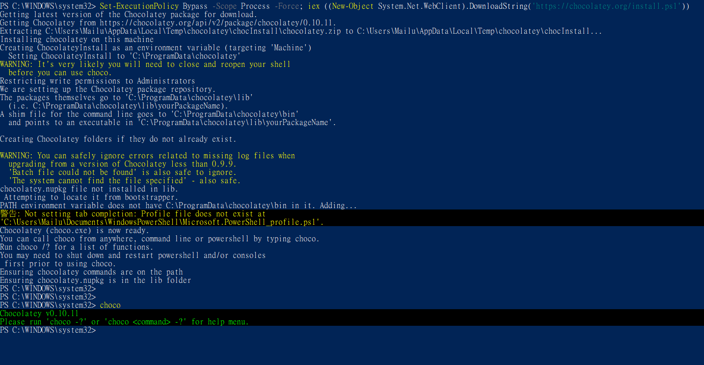
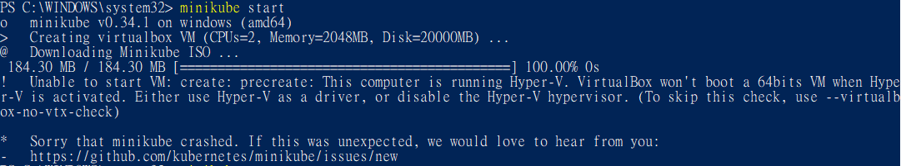
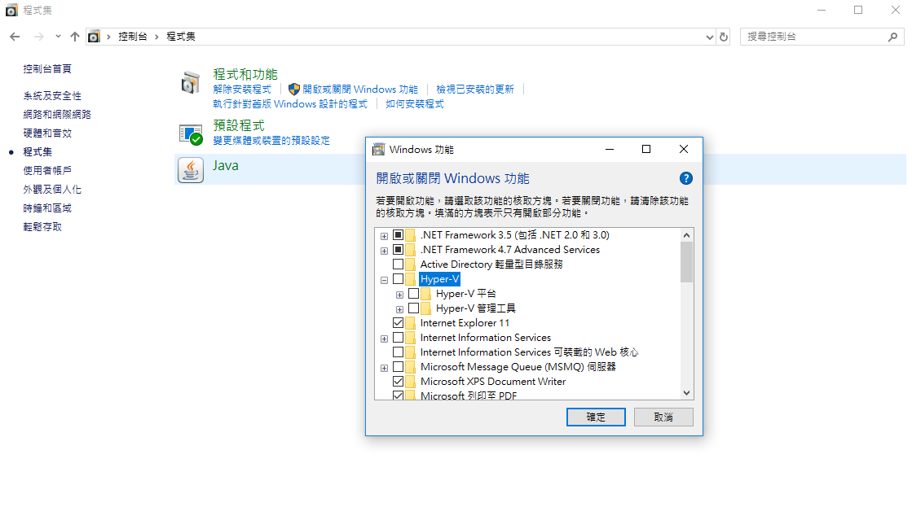
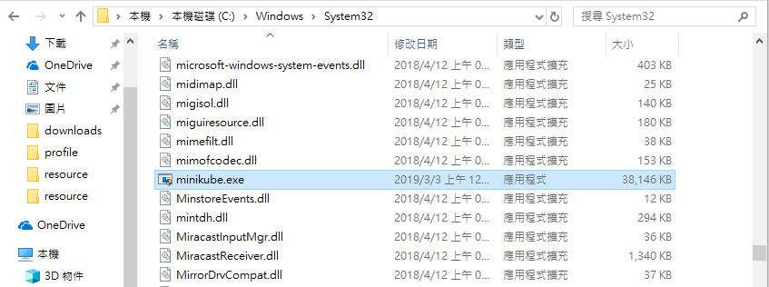
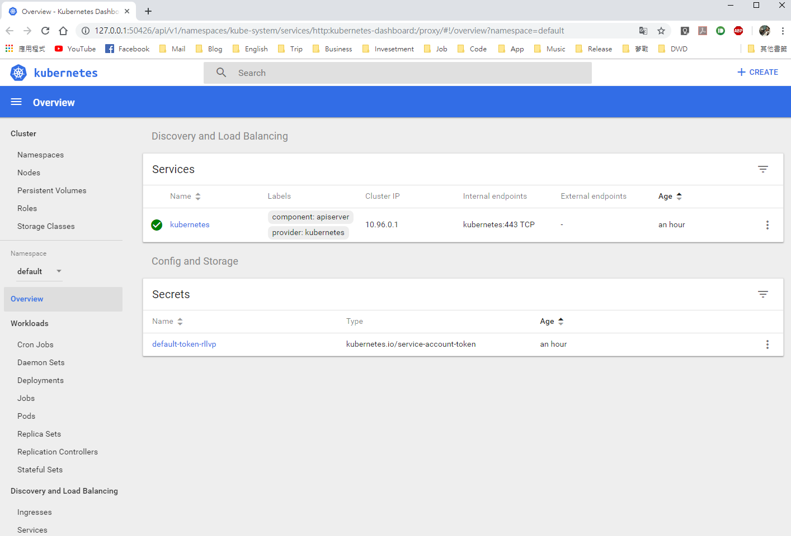

# Kubernetes

## 1. Kubernetes(k8s)觀念


## 2. Install Minikube with Chocolatey on Windows

1. 這篇文章以Windows環境為主，若為Mac可以參考官網。首先以系統管理員啟動PowerShell並輸入下列指令安裝`Chocolatey`：
    ```
    $ Set-ExecutionPolicy Bypass -Scope Process -Force; iex ((New-Object System.Net.WebClient).DownloadString('https://chocolatey.org/install.ps1'))
    ```
1. 輸入下列指令檢查是否安裝成功：
    ```
    $ choco
    Chocolatey v0.10.11
    Please run 'choco -?' or 'choco <command> -?' for help menu.
    ```
    
1. 接下來輸入指令安裝minikube：
    ```
    $ choco install minikube
    ```
1. 啟動Minikube。
    ```
    $ minikube start --vm-driver="virtualbox"
    ```
1. 如果您的電腦同時安裝VirtualBox和Hyper-V將會衝突導致錯誤，需要關閉一個(若無錯誤可以跳過這段)。本例是使用VirtualBox，請先到控制台程式集關閉Hyper-V，並重新啟動。
    
    <br>
    <br>
    
* 但筆者重新啟動後仍然報錯，可能是因為使用Docker桌面版預設使用Hyper-V，所以只好改用下面的手動安裝方法。
* 請參考[minikube github](https://github.com/kubernetes/minikube#installation)說明。

## 3. Install Minikube manually

1. 如果您已經安裝成功請略過本節。
1. 先下載並安裝VirtualBox。
1. 下載[kubectl.exe](https://storage.googleapis.com/kubernetes-release/release/v1.9.0/bin/windows/amd64/kubectl.exe)並放到`C:Windows\system32`中。
    
1. 請到[minikube](https://github.com/kubernetes/minikube/releases)發行下載最新的minikube，這裡使用的版本是`Minikube v0.33.1`。並將下載下來的exe檔案重新命名為`minikube.exe`並放到`C:Windows\system32`中。
    
1. 輸入下列指令可以看到版本：
    ```
    $ minikube version
    minikube version: v0.33.1
    ```
1. 輸入指令啟動服務，並查看狀態：
    ```
    $ minikube start --vm-driver="virtualbox"
    Starting local Kubernetes v1.13.2 cluster...
    Starting VM...
    Getting VM IP address...
    ...

    Everything looks great. Please enjoy minikube!
    $ minikube status
    host: Running
    kubelet: Running
    apiserver: Running
    kubectl: Correctly Configured: pointing to minikube-vm at 192.168.99.100
    ```
1. 確認cluster狀態：
    ```
    $ kubectl cluster-info
    Kubernetes master is running at https://192.168.99.100:8443
    KubeDNS is running at https://192.168.99.100:8443/api/v1/namespaces/kube-system/services/kube-dns:dns/proxy

    To further debug and diagnose cluster problems, use 'kubectl cluster-info dump'.
    ```
1. 打開minikube dashboard：
    ```
    $ minikube dashboard
    Enabling dashboard ...
    Verifying dashboard health ...
    Launching proxy ...
    Verifying proxy health ...
    Opening http://127.0.0.1:50426/api/v1/namespaces/kube-system/services/http:kubernetes-dashboard:/proxy/ in your default browser...
    ```
    

*  請參考[Installing Minikube on Windows 10 Home Edition using VirtualBox](https://www.assistanz.com/installing-minikube-on-windows-10-home-edition-using-virtualbox/)文章。
