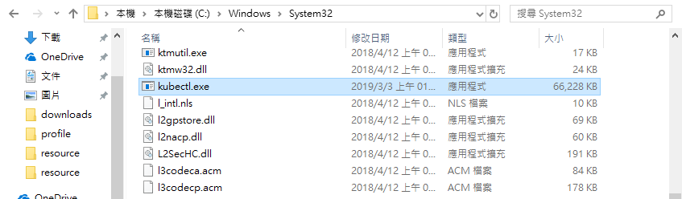
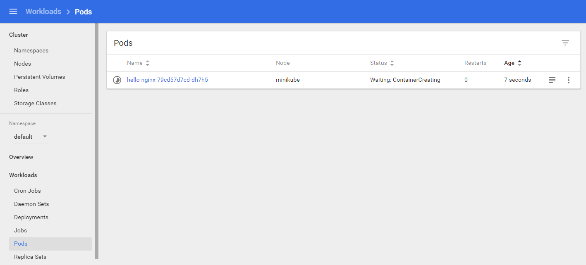

# Kubernetes

## 1. Kubernetes(k8s)觀念


## 2. Install Minikube with Chocolatey on Windows

1. 這篇文章以Windows環境為主，若為Mac可以參考官網。首先以系統管理員啟動PowerShell並輸入下列指令安裝`Chocolatey`：
    ```
    $ Set-ExecutionPolicy Bypass -Scope Process -Force; iex ((New-Object System.Net.WebClient).DownloadString('https://chocolatey.org/install.ps1'))
    ```
1. 輸入下列指令檢查是否安裝成功：
    ```
    $ choco
    Chocolatey v0.10.11
    Please run 'choco -?' or 'choco <command> -?' for help menu.
    ```
    
1. 接下來輸入指令安裝minikube：
    ```
    $ choco install minikube
    ```
1. 啟動Minikube。
    ```
    $ minikube start --vm-driver="virtualbox"
    ```
1. 如果您的電腦同時安裝VirtualBox和Hyper-V將會衝突導致錯誤，需要關閉一個(若無錯誤可以跳過這段)。如果您是使用Docker桌面版，有內建Hyper-V，建議刪除VirtualBox。

    
* 但筆者想要使用VirtualBox來操作，所以不能使用Docker桌面版，必須使用Docker Toolbox，詳細步驟請參考手動安裝。

* 請參考[minikube github](https://github.com/kubernetes/minikube#installation)說明。

## 3. Install Minikube manually

1. 如果您想要在Windows環境中使用VirtualBox，則不能使用Docker Desktop，因為其中有內建Hyper-V會導致衝突，需要使用舊版的Docker Toolbox。
1. 請先到程式集刪除Docker Desktop。
1. 到控制台程式集關閉Hyper-V，並重新啟動。 

    
1. 先下載並安裝VirtualBox。 
1. 安裝[Docker Toolbox](https://docs.docker.com/toolbox/toolbox_install_windows/)，下載完後執行，並點選下一步安裝。 
1. 安裝完成後，請點選桌面上的Docker Quickstart啟動。 

    
1. 啟動完成如下圖。 

    
1. 下載[kubectl.exe](https://storage.googleapis.com/kubernetes-release/release/v1.9.0/bin/windows/amd64/kubectl.exe)並放到`C:Windows\system32`中。 

    
1. 請到[minikube](https://github.com/kubernetes/minikube/releases)發行下載最新的minikube，這裡使用的版本是`Minikube v0.33.1`。並將下載下來的exe檔案重新命名為`minikube.exe`並放到`C:Windows\system32`中。

    
1. 輸入下列指令可以看到版本：
    ```
    $ minikube version
    minikube version: v0.33.1
    ```
1. 輸入指令啟動服務，並查看狀態：
    ```
    $ minikube start --vm-driver="virtualbox"
    Starting local Kubernetes v1.13.2 cluster...
    Starting VM...
    Getting VM IP address...
    ...

    Everything looks great. Please enjoy minikube!
    $ minikube status
    host: Running
    kubelet: Running
    apiserver: Running
    kubectl: Correctly Configured: pointing to minikube-vm at 192.168.99.100
    ```
    
1. 確認cluster狀態：
    ```
    $ kubectl cluster-info
    Kubernetes master is running at https://192.168.99.100:8443
    KubeDNS is running at https://192.168.99.100:8443/api/v1/namespaces/kube-system/services/kube-dns:dns/proxy

    To further debug and diagnose cluster problems, use 'kubectl cluster-info dump'.
    ```
1. 打開minikube dashboard：
    ```
    $ minikube dashboard
    Enabling dashboard ...
    Verifying dashboard health ...
    Launching proxy ...
    Verifying proxy health ...
    Opening http://127.0.0.1:50426/api/v1/namespaces/kube-system/services/http:kubernetes-dashboard:/proxy/ in your default browser...
    ```
    

* 如果在啟動過程中出現錯誤如下是因為手動關閉Virtualbox中的虛擬機造成，可以輸入指令`minikube delete`後再次啟動即可：
    ```
    $ minikube start --vm-driver="virtualbox"
    Starting local Kubernetes v1.13.2 cluster...
    Starting VM...
    E0303 10:59:42.604647   14748 start.go:205] Error starting host: Error getting state for host: machine does not exist.

    Retrying.
    E0303 10:59:42.606602   14748 start.go:211] Error starting host:  Error getting state for host: machine does not exist


    minikube failed :( exiting with error code 1
    $ minikube delete
    Deleting local Kubernetes cluster...
    Machine deleted.
    $ minikube start
    ```
* 請參考[Installing Minikube on Windows 10 Home Edition using VirtualBox](https://www.assistanz.com/installing-minikube-on-windows-10-home-edition-using-virtualbox/)文章。

## 4. 叢集操作

* 叢集(cluster)資訊。
    ```
    $ kubectl cluster-info
    Kubernetes master is running at https://192.168.99.101:8443
    KubeDNS is running at https://192.168.99.101:8443/api/v1/namespaces/kube-system/services/kube-dns:dns/proxy

    To further debug and diagnose cluster problems, use 'kubectl cluster-info dump'.
    ```
* 檢查k8s在server和client的版本。注意到Client端版本是1.9(`Major:"1", Minor:"9"`)，Server端是1.13。
    ```
    $ kubectl version
    Client Version: version.Info{Major:"1", Minor:"9", GitVersion:"v1.9.0", GitCommit:"925c127ec6b946659ad0fd596fa959be43f0cc05", GitTreeState:"clean", BuildDate:"2017-12-15T21:07:38Z", GoVersion:"go1.9.2", Compiler:"gc", Platform:"windows/amd64"}
    Server Version: version.Info{Major:"1", Minor:"13", GitVersion:"v1.13.2", GitCommit:"cff46ab41ff0bb44d8584413b598ad8360ec1def", GitTreeState:"clean", BuildDate:"2019-01-10T23:28:14Z", GoVersion:"go1.11.4", Compiler:"gc", Platform:"linux/amd64"}
    ```
* Cluster IP資訊。
    ```
    $ minikube ip
    192.168.99.101
    ```
* 查看節點(nodes)，如果kubectl沒有指到正確的cluster(minikube)將會報錯`error: You must be logged in to the server (the server has asked for the client to provide credentials)`：
    ```
    $ kubectl get nodes
    NAME       STATUS    ROLES     AGE       VERSION
    minikube   Ready     master    2h        v1.13.2
    ```
* 如果有多個cluster可以透過下列語法查詢(目前只有一個minikube)：
    ```
    $ kubectl config get-contexts
    CURRENT   NAME       CLUSTER    AUTHINFO   NAMESPACE
    *         minikube   minikube   minikube
    ```
* 切換cluster語法是`kubectl config use-context [cluster name]`。
    ```
    $ kubectl config use-context minikube
    Switched to context "minikube"
    ```
## 5. 啟動服務

* 以下示範啟動Nginx容器，`kubectl run [name] --image=[image name]`可以創建並運行image，並且建立一個deployment或job來管理容器。另外可以用`--port`來指定port。
    ```
    $ kubectl run hello-nginx --image=nginx --port=80
    deployment "hello-nginx" created
    ```
* 查看pods。
    ```
    $ kubectl get pods
    NAME                           READY     STATUS    RESTARTS   AGE
    hello-nginx-79cd57d7cd-62qp2   1/1       Running   0          49s
    ```
* 到minikube dashboard的Deploymeny可以看到hello-nginx已被部署。

    
* 接著點到Replica Sets，並點選名稱進入將可以看到各種服務細節。

    
    <br>
    <br>
    
* 請點選Pods，可以看到各種Pod細節。

    
    <br>
    <br>
    
* 上述操作也可以透過指令查看。
    ```
    $ kubectl describe node
    $ kubectl describe pod
    ```

## 6. 服務對外

* Pod中的容器已經啟動並部署，但還未對外。下列指令可以讓服務對外。
    ```
    $ kubectl expose deployment hello-nginx --type=NodePort
    service "hello-nginx" exposed
    ```
* `--type`參數可以使用`ClusterIP(default)`、`NodePort`、`LoadBalancer`等，以下一一介紹：
    1. `ClusterIP(default)`：服務在內部啟動，只允許cluster內的服務拜訪，沒有對外的接口。但外部仍然可以透過Kubernetes proxy來拜訪服務。一般是在debug時使用，生產環境不會使用。
    1. `NodePort`：在所有的Node(就是VM)上開一個特定的port讓外部直接拜訪服務。這個做法會有些限制，每個port只能有一個服務，可使用的port範圍為30000–32767，如果Node(VM)的IP改變的話可能要重新設定。
    1. `LoadBalancer`：提供一致的IP提供外部拜訪，並由負載平衡(load balancer)決定打到哪一個服務。這個方式最大的缺點是每一個服務就有一個對外的IP，成本相對較高。
    1. 還有其他參數，請參考[Kubernetes NodePort vs LoadBalancer vs Ingress? When should I use what?](https://medium.com/google-cloud/kubernetes-nodeport-vs-loadbalancer-vs-ingress-when-should-i-use-what-922f010849e0)。
* 檢查服務對外狀態。可以透過指令或是直接在minikube dashboard看到。
    ```
    $ kubectl get services
    NAME          TYPE        CLUSTER-IP     EXTERNAL-IP   PORT(S)        AGE
    hello-nginx   NodePort    10.97.40.162   <none>        80:30683/TCP   1m
    kubernetes    ClusterIP   10.96.0.1      <none>        443/TCP        38m
    $ kubectl describe service hello-nginx
    Name:                     hello-nginx
    Namespace:                default
    Labels:                   run=hello-nginx
    Annotations:              <none>
    Selector:                 run=hello-nginx
    Type:                     NodePort
    IP:                       10.97.40.162
    Port:                     <unset>  80/TCP
    TargetPort:               80/TCP
    NodePort:                 <unset>  30683/TCP
    Endpoints:                172.17.0.5:80
    Session Affinity:         None
    External Traffic Policy:  Cluster
    Events:                   <none>
    ```
    
* 透過下列指令可以取得該服務對外的入口。
    ```
    $ minikube service --url=true hello-nginx
    http://192.168.99.100:30683
    ```
* 將參數`url`拿掉可以直接帶到瀏覽器如下所示：

    
* 接下請回到minikube dashboard的services列表，並進入hello-nginx可以查看log。

    
    <br>
    <br>
    
* 也可以透過指令查看log。
    ```
    $ kubectl logs hello-nginx-79cd57d7cd-dh7h5
    172.17.0.1 - - [03/Mar/2019:07:23:27 +0000] "GET / HTTP/1.1" 200 612 "-" "Mozilla/5.0 (Windows NT 10.0; Win64; x64) AppleWebKit/537.36 (KHTML, like Gecko) Chrome/72.0.3626.119 Safari/537.36" "-"
    2019/03/03 07:23:27 [error] 6#6: *1 open() "/usr/share/nginx/html/favicon.ico" failed (2: No such file or directory), client: 172.17.0.1, server: localhost, request: "GET /favicon.ico HTTP/1.1", host: "192.168.99.100:30683", referrer: "http://192.168.99.100:30683/"
    172.17.0.1 - - [03/Mar/2019:07:23:27 +0000] "GET /favicon.ico HTTP/1.1" 404 555 "http://192.168.99.100:30683/" "Mozilla/5.0 (Windows NT 10.0; Win64; x64) AppleWebKit/537.36 (KHTML, like Gecko) Chrome/72.0.3626.119 Safari/537.36" "-"
    ```

## 7. Scaling up/down

* 使用指令將hello-nginx服務增加到3個。
    ```
    $ kubectl scale --replicas=3 deployment/hello-nginx
    deployment "hello-nginx" scaled
    ```
* 查詢部署狀態有3個服務。
    ```
    $ kubectl get deployment
    NAME          DESIRED   CURRENT   UP-TO-DATE   AVAILABLE   AGE
    hello-nginx   3         3         3            3           44m
    ```
* 從minikube dashboard也可以看到已經增加為3個服務。
    
    <br>
    <br>
    
    <br>
    <br>
    

## 8. 關閉minikube

* 請先停止minikube後再關閉，語法如下：
    ```
    $ minikube stop
    Stopping local Kubernetes cluster...
    Machine stopped.
    $ minikube delete
    Deleting local Kubernetes cluster...
    Machine deleted.
    ```